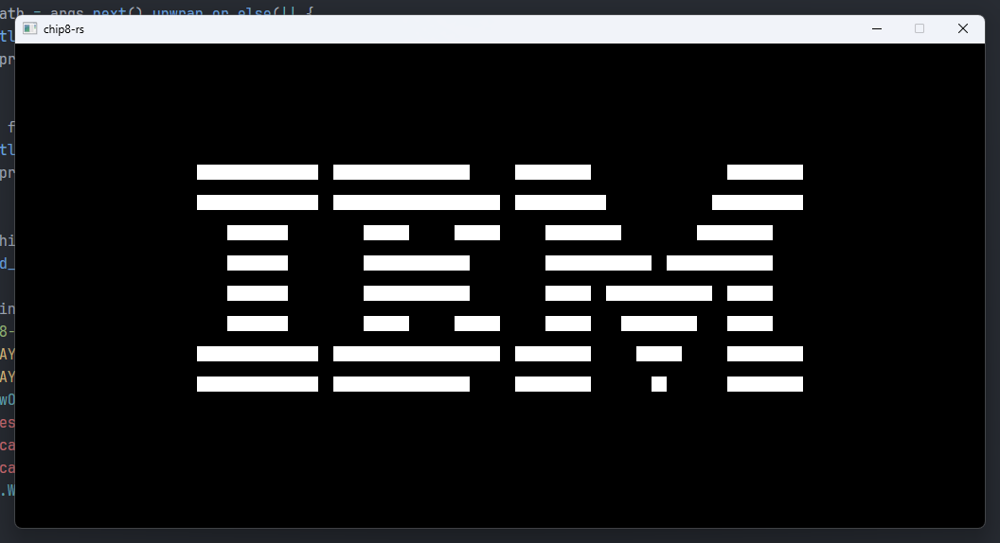

# 🦀 chip8-rs

A simple CHIP-8 emulator.

## Quick Start
```bash
cargo run -- "path/to/rom"

# ex
cargo run -- "./roms/breakout.ch8"
cargo run -- "./roms/IBM Logo.ch8"
cargo run -- "./roms/test_opcode.ch8"
cargo run -- "./roms/tetris.ch8"
```

```python
# keypad
1 2 3 4
Q W E R
A S D F
Z X C V
```
